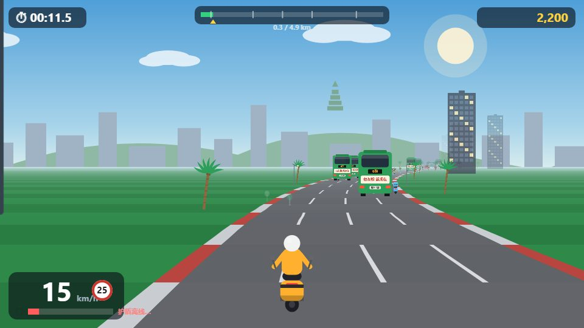
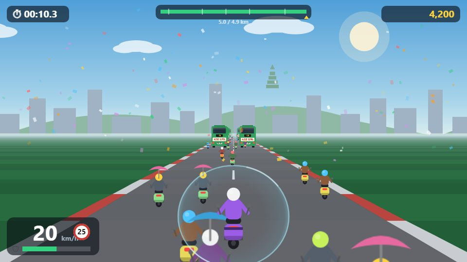

# 🛵 电驴风云 · 南宁 — Scooter Rush: Nanning

[English](README.md) | **简体中文**

**▶ 在线试玩：[scooter-rush-nanning.pages.dev](https://scooter-rush-nanning.pages.dev/)**

一款《暴力摩托》风格的伪 3D 赛车小游戏，主角是南宁传说中的电驴大军——但没有暴力。
你的电驴自带保护罩：任何靠得太近的车辆和行人都会「砰」地一声变成彩纸，
再坐着气球安全飘回家。礼貌超车，物理执行。

| 飞驰民族大道 | 青秀山终点冲线 |
| --- | --- |
|  |  |

## 特色

- **赛道**：朝阳广场 → 民族大道 → 中山路美食街 → 邕江大桥 → 青环路 → 青秀山
- **4 位骑手**：外卖侠、买菜阿姨、上班族、迟到边缘的大学生——极速 / 灵活 / 护盾各有千秋
- **护盾弹飞**消耗能量并积累连击得分——能量耗尽时被撞会打滑失控
- **喇叭（空格）**：不想弹飞别人？按喇叭礼貌劝离
- **无敌模式**开关（选人界面）——金色无限护盾、永不打滑（无敌局不计入最佳成绩）
- **井盖**——南宁路面真正的最终 Boss：压上去护盾哐当掉血
- **💑 带上对象模式**：后座载人得分 ×1.5——但每压一个井盖 TA 都会*立刻*生气，怒气拉满 TA 直接坐气球回家。TA 对压白线骑行也很有意见。灵感来自一位真实存在的女朋友、真实存在的井盖，以及真实存在的车道线。
- 打伞电驴、桂A 绿色出租车、6 路公交（弹飞一辆奖励「公交霸主 +500」）、老友粉摊，以及那块没人理的「限速 25」牌子
- 中英双语界面，WebAudio 合成音效（无音频资源），本地最佳成绩记录
- **零依赖**——纯 HTML/CSS/JS + Canvas 2D，无需构建

## 本地运行

```
node serve.js   →  http://127.0.0.1:4326
```

也可以用任何静态文件服务器直接托管本目录——`serve.js` 只是个零依赖的便利工具
（其中的 `/__capture` 接口仅用于开发调试）。

## 部署

游戏是纯静态页面，任何静态托管都能跑——以 **Cloudflare Pages** 为例：
连接本仓库，构建命令留空，输出目录填 `/`，即可上线。

## 操作

| 按键 | 动作 |
| --- | --- |
| ↑ / W | 加速 |
| ↓ / S | 刹车 |
| ← → / A D | 转向 |
| 空格 | 喇叭（劝离车流） |
| Esc / P | 暂停 |
| M | 静音 |

## 致谢

本项目使用 [Claude Code](https://claude.com/claude-code) 构建，由 **Claude Fable 5**
设计、编写并亲自试玩调校——从伪 3D 道路引擎到最后一个老友粉梗。🤖
